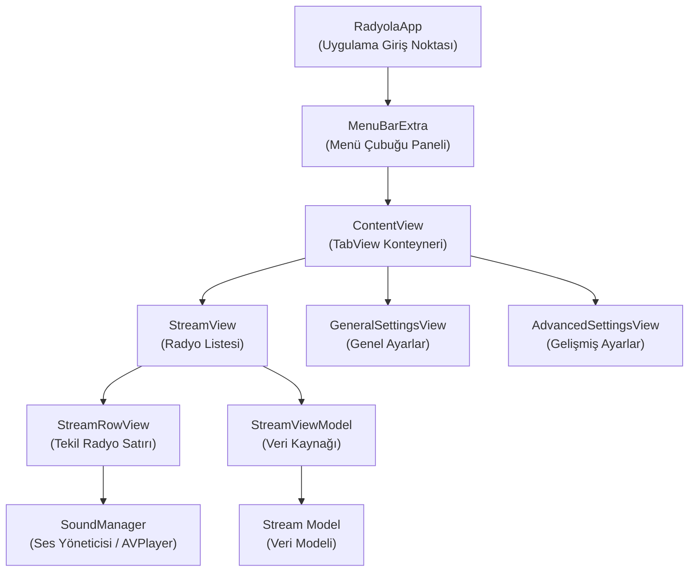
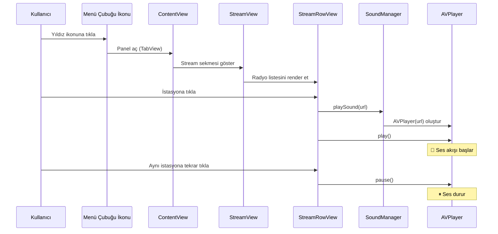

# Radyola — Proje Analizi

## Genel Bakış

**Radyola**, macOS menü çubuğunda (menu bar) yaşayan, SwiftUI ile geliştirilmiş bir **internet radyo akışı (stream) çalar** uygulamasıdır. Uygulama herhangi bir ana pencereye sahip değildir; bunun yerine macOS menü çubuğundaki yıldız ikonuna tıklandığında açılan küçük bir panel üzerinden çalışır.

| Özellik | Değer |
|---|---|
| **Platform** | macOS 13.0+ (Ventura) |
| **Dil** | Swift / SwiftUI |
| **Proje Tipi** | Xcode Native (`.xcodeproj`) |
| **UI Modeli** | `MenuBarExtra` (pencere stili) |
| **Ses Altyapısı** | AVFoundation (`AVPlayer`) |
| **Sandbox** | Aktif (ağ erişimi etkin) |

---

## Hazır Uygulama

Her değişiklikte CI uygulamayı derler —
[Actions → macOS](https://github.com/aripdcom/radyola/actions/workflows/macos.yml)
→ bir koşu seçin → **Artifacts** (`Radyola-macos.zip`). Sürüm etiketlerinde
[Releases](https://github.com/aripdcom/radyola/releases) sayfasına da eklenir.

> Paket **imzasızdır** (Apple geliştirici sertifikası gerektirmemek için):
> zip'i açıp `Radyola.app`'i Applications'a taşıyın; ilk açılışta Gatekeeper
> uyarısını **sağ tık → Aç** ile geçin.

## Mimari



---

## Dosya Yapısı

```
Radyola/
├── Radyola.xcodeproj/          # Xcode proje dosyaları
├── Radyola/
│   ├── RadyolaApp.swift         # @main — Uygulama giriş noktası
│   ├── ContentView.swift        # Ana TabView konteyneri
│   ├── StreamView.swift         # Radyo akışı listesi + model + row view
│   ├── HelloView.swift          # Prototip/test görünümü (kullanılmıyor)
│   ├── SoundManager.swift       # AVPlayer sarmalayıcı ses yöneticisi
│   ├── GeneralSettingsView.swift # Genel ayarlar formu
│   ├── AdvancedSettingsView.swift# Gelişmiş ayarlar placeholder'ı
│   ├── Radyola.entitlements     # Sandbox & ağ erişim hakları
│   ├── Assets.xcassets/         # Uygulama ikonu & renk setleri
│   └── Preview Content/        # Xcode önizleme varlıkları
├── .gitignore
└── README.md
```

---

## Bileşen Detayları

### 1. RadyolaApp.swift — Uygulama Giriş Noktası

[RadyolaApp.swift](file:///srv/codebase/aripd/playground/mactile/macosx/Radyola/RadyolaApp.swift)

```swift
@available(macOS 13.0, *)
@main
struct RadyolaApp: App {
    @AppStorage("showMenuBarExtra") private var showMenuBarExtra = true
    ...
}
```

- `@main` ile uygulamanın giriş noktası olarak işaretlenmiştir.
- macOS 13.0+ gerektiren `MenuBarExtra` API'sini kullanır.
- Menü çubuğunda `star.fill` (yıldız) ikonu ile görünür.
- `.menuBarExtraStyle(.window)` ile tıklandığında açılır pencere (popover) stilinde bir panel gösterir.
- `showMenuBarExtra` değeri `@AppStorage` ile kalıcı olarak saklanır.

> [!NOTE]
> Dosyada kullanılmayan bir `body1` property'si bulunmaktadır. Bu, geliştirme sürecinde denenen alternatif bir menü yapısıdır (butonlu menü stili). Aktif değildir çünkü Swift'te `some Scene` dönen tek bir `body` geçerlidir.

---

### 2. ContentView.swift — Ana TabView Konteyneri

[ContentView.swift](file:///srv/codebase/aripd/playground/mactile/macosx/Radyola/ContentView.swift)

Uygulamanın menü panelinde görüntülenen ana görünümdür. Üç sekmeli bir `TabView` barındırır:

| Sekme | Görünüm | İkon | Açıklama |
|---|---|---|---|
| **Stream** | `StreamView` | `waveform.circle` | Radyo istasyonları listesi |
| **General** | `GeneralSettingsView` | `gear` | Genel ayarlar |
| **Advanced** | `AdvancedSettingsView` | `star` | Gelişmiş ayarlar (placeholder) |

- Panel boyutu: **375×150 pt** sabit çerçeve.
- 20pt iç boşluk (padding) uygulanmıştır.

---

### 3. StreamView.swift — Radyo Akışı Modülü

[StreamView.swift](file:///srv/codebase/aripd/playground/mactile/macosx/Radyola/StreamView.swift)

Bu dosya projenin **çekirdek işlevselliğini** barındırır. Dört ayrı yapıyı içerir:

#### 3.1 Stream (Model)

```swift
struct Stream: Identifiable {
    var id = UUID()
    var author: String
    var title: String
    var url: String
}
```

Her radyo istasyonunu temsil eden basit bir veri modeli. `Identifiable` protokolünü uygulayarak SwiftUI listelerinde benzersiz tanımlama sağlar.

#### 3.2 Stream.samples (Statik Veri)

Uygulamada **18 adet radyo istasyonu** yerleşik (hardcoded) olarak tanımlıdır:

| # | İstasyon | Ülke/Kaynak | Format |
|---|---|---|---|
| 1 | Açık Radyo | 🇹🇷 Türkiye | MP3 |
| 2 | Sputnik Türkiye | 🇷🇺 Rusya (Türkçe) | MP3 |
| 3 | ITU Radio Jazz/Blues | 🇹🇷 İTÜ | PLS |
| 4 | ITU Radio Classical | 🇹🇷 İTÜ | PLS |
| 5 | MUSIQ3 | 🇧🇪 Belçika (RTBF) | AAC-256 |
| 6 | VRT Klara | 🇧🇪 Belçika (VRT) | MP3 |
| 7 | Viva Brabant Wallon | 🇧🇪 Belçika (RTBF) | AAC-128 |
| 8 | ITU Radio Rock | 🇹🇷 İTÜ | PLS |
| 9 | BBC Radio 1 | 🇬🇧 İngiltere | PLS |
| 10 | BBC World Service News | 🇬🇧 İngiltere | PLS |
| 11 | Radyo TRT Haber | 🇹🇷 Türkiye | AAC |
| 12 | NTV Radyo | 🇹🇷 Türkiye | HLS (m3u8) |
| 13 | HABERTÜRK Radyo | 🇹🇷 Türkiye | HLS (m3u8) |
| 14 | Radio Panik | 🇧🇪 Belçika | MP3 |
| 15 | Radyo Bozcaada | 🇹🇷 Türkiye | Stream |
| 16 | Radyo Gökçeada | 🇹🇷 Türkiye | Stream |
| 17 | Radyo Boğaziçi | 🇹🇷 Türkiye | Stream |
| 18 | Μινόρε Καλλονής | 🇬🇷 Yunanistan | Stream |

> [!TIP]
> İstasyon seçimi Türkiye, Belçika, İngiltere ve Yunanistan'dan radyoları kapsıyor — geliştiricinin kişisel tercihleri ve yaşam coğrafyasını yansıtmaktadır.

#### 3.3 StreamViewModel

```swift
private class StreamViewModel: ObservableObject {
    @Published var streams: [Stream] = Stream.samples
}
```

MVVM desenini takip eden minimal bir ViewModel. `@Published` ile SwiftUI'ye reaktif veri bağlama sağlar. Şu an statik veriyi doğrudan yüklemektedir.

#### 3.4 StreamRowView

Her radyo istasyonunu listede gösteren satır bileşeni:

- Play/Pause ikonunu (`play.circle.fill` / `pause.circle.fill`) duruma göre değiştirir.
- İstasyon adını (`headline`) ve yazarını (`subheadline`) gösterir.
- `onTapGesture` ile tıklamada:
  1. `SoundManager.playSound()` çağrılarak `AVPlayer` oluşturulur
  2. `song1` durumu toggle edilir
  3. Duruma göre `play()` veya `pause()` çağrılır

---

### 4. SoundManager.swift — Ses Yöneticisi

[SoundManager.swift](file:///srv/codebase/aripd/playground/mactile/macosx/Radyola/SoundManager.swift)

```swift
class SoundManager: ObservableObject {
    var audioPlayer: AVPlayer?

    func playSound(sound: String) {
        if let url = URL(string: sound) {
            self.audioPlayer = AVPlayer(url: url)
        }
    }
}
```

- `AVFoundation` framework'ünü kullanır.
- URL string'inden `AVPlayer` nesnesi oluşturur.
- Internet üzerinden ses akışı oynatabilir (streaming destekli).
- `ObservableObject` protokolü ile SwiftUI state yönetimine entegre edilmiştir.

> [!WARNING]
> Her `playSound()` çağrısında yeni bir `AVPlayer` oluşturulduğundan, aynı satıra tekrar tıklandığında mevcut player sıfırlanır. Bu, birden fazla istasyonun aynı anda çalmasını engeller ancak tıklama sırasında kısa bir kesinti yaşanabilir.

---

### 5. GeneralSettingsView.swift — Genel Ayarlar

[GeneralSettingsView.swift](file:///srv/codebase/aripd/playground/mactile/macosx/Radyola/GeneralSettingsView.swift)

İki ayar sunar:

| Ayar | Tip | Varsayılan | Açıklama |
|---|---|---|---|
| `showPreview` | Toggle | `true` | Önizleme gösterimi (henüz entegre değil) |
| `fontSize` | Slider (9–96) | `12.0` | Font boyutu (henüz entegre değil) |

- Her iki ayar `@AppStorage` ile UserDefaults'ta kalıcı olarak saklanır.
- Ancak bu ayarlar henüz StreamView veya diğer görünümlere bağlanmamıştır — **prototip aşamasındadır**.

---

### 6. AdvancedSettingsView.swift — Gelişmiş Ayarlar

[AdvancedSettingsView.swift](file:///srv/codebase/aripd/playground/mactile/macosx/Radyola/AdvancedSettingsView.swift)

- Yalnızca bir dünya ikonu (`globe`) ve "Hello, world!" metni gösterir.
- **Tamamen placeholder** bir görünümdür, işlevsel içerik henüz eklenmemiştir.

---

### 7. HelloView.swift — Test Görünümü

[HelloView.swift](file:///srv/codebase/aripd/playground/mactile/macosx/Radyola/HelloView.swift)

- "Hello from statusbar" metnini gösteren basit bir test görünümü.
- Projede **aktif olarak kullanılmamaktadır**.
- Geliştirme sürecinde MenuBarExtra davranışını test etmek için oluşturulmuş bir prototiptir.

---

### 8. Radyola.entitlements — Uygulama Hakları

[Radyola.entitlements](file:///srv/codebase/aripd/playground/mactile/macosx/Radyola/Radyola.entitlements)

| Hak (Entitlement) | Değer | Açıklama |
|---|---|---|
| `com.apple.security.app-sandbox` | `true` | App Sandbox aktif |
| `com.apple.security.files.user-selected.read-only` | `true` | Kullanıcı seçtiği dosyalara salt okunur erişim |
| `com.apple.security.network.client` | `true` | **Giden ağ bağlantılarına izin** (radyo stream'leri için kritik) |

> [!IMPORTANT]
> `network.client` entitlement'ı olmadan uygulama internet radyo akışlarını çalamaz. Bu, uygulamanın çekirdek işlevi için zorunlu bir haktır.

---

## Veri Akışı



---

## Git Geçmişi

Proje 8 commit ile geliştirilmiştir:

| Commit | Mesaj | Açıklama |
|---|---|---|
| `5593cc9` | Initial Commit | İlk proje oluşturma |
| `8fbb79e` | initial commit | — |
| `7330566` | Initial commit | — |
| `d5c2642` | update for the new version of swift | `MenuBarExtra` API'sine geçiş (macOS 13+) |
| `642c9e9` | added Stream support | Radyo akışı desteği eklendi |
| `888a736` | added streams as list | İstasyonlar liste olarak düzenlendi |
| `c98470f` | update | Güncelleme |
| `6aa83ad` | update | Güncelleme (HEAD) |

---

## Teknoloji & Framework Özeti

| Kategori | Kullanılan |
|---|---|
| **UI Framework** | SwiftUI |
| **Uygulama Yaşam Döngüsü** | SwiftUI App protocol |
| **Menü Çubuğu** | `MenuBarExtra` (macOS 13+) |
| **Ses Oynatma** | `AVFoundation` / `AVPlayer` |
| **State Yönetimi** | `@State`, `@StateObject`, `@AppStorage`, `@Published` |
| **Mimari Desen** | MVVM (basitleştirilmiş) |
| **Kalıcı Depolama** | `UserDefaults` (`@AppStorage` aracılığıyla) |
| **Minimum Platform** | macOS 13.0 (Ventura) |

---

## Geliştirme Durumu & Notlar

> [!NOTE]
> Proje bir **playground / prototip** (deney alanı) olarak konumlandırılmıştır. Temel radyo çalma işlevselliği çalışır durumdadır ancak birçok alan tamamlanmamıştır.

### ✅ Tamamlanan Özellikler
- Menü çubuğu entegrasyonu (MenuBarExtra)
- Radyo istasyonu listesi (18 istasyon)
- Play/Pause kontrolü
- Temel ses akışı oynatma (AVPlayer)

### 🚧 Tamamlanmamış / Prototip Aşamasında
- **GeneralSettingsView** ayarları (font boyutu, önizleme) hiçbir yere bağlı değil
- **AdvancedSettingsView** tamamen placeholder
- **HelloView** kullanılmıyor
- `RadyolaApp.body1` alternatif menü yapısı kullanılmıyor

### ⚠️ Bilinen Kısıtlamalar
- Birden fazla istasyona tıklandığında önceki akış durmaz (her satır kendi `SoundManager`'ına sahip)
- Volume (ses seviyesi) kontrolü yok
- İstasyon ekleme/silme UI'sı yok — tüm istasyonlar hardcoded
- Hata yönetimi (bağlantı hatası, akış kesilmesi) implementasyonu yok
- "Now Playing" bilgisi (şu an çalan şarkı metadata'sı) gösterilmiyor
